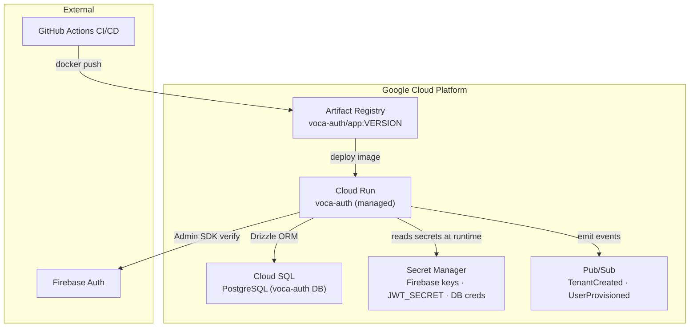

# Deployment Guide — Voca Auth

> **Service:** Centralized SSO & Identity Gateway
> **Target Platform:** Google Cloud Run (serverless, scale-to-zero)
> **Runtime:** Next.js 16+ (Node.js), containerized via Docker

---

## Table of Contents

1. [Infrastructure Overview](#1-infrastructure-overview)
2. [Prerequisites & Tooling](#2-prerequisites--tooling)
3. [Environment Variables & Secrets](#3-environment-variables--secrets)
4. [Local Development Setup](#4-local-development-setup)
5. [Database Migrations](#5-database-migrations)
6. [Building the Container Image](#6-building-the-container-image)
7. [Deploying to Cloud Run](#7-deploying-to-cloud-run)
8. [CI/CD Pipeline (GitHub Actions)](#8-cicd-pipeline-github-actions)
9. [Post-Deploy Verification Checklist](#9-post-deploy-verification-checklist)
10. [Traffic Management & Rollback](#10-traffic-management--rollback)
11. [Staging vs Production Environments](#11-staging-vs-production-environments)
12. [Observability & Monitoring](#12-observability--monitoring)
13. [Security Constraints](#13-security-constraints)

---

## 1. Infrastructure Overview



### Key Services

| Service                | Purpose                                         | GCP Product              |
|------------------------|-------------------------------------------------|--------------------------|
| Container runtime      | Hosts the Next.js application                   | Cloud Run (managed)      |
| Container registry     | Stores versioned Docker images                  | Artifact Registry        |
| Relational database    | Tenants, Users, Tenant_Users, RBAC              | Cloud SQL (PostgreSQL 15) |
| Secret storage         | Firebase keys, JWT secret, DB URL               | Secret Manager           |
| Event streaming        | `TenantCreated`, `UserProvisioned` events       | Cloud Pub/Sub            |
| Identity provider      | Client-side auth + Admin SDK token verification | Firebase Authentication  |

---

## 2. Prerequisites & Tooling

### Required Tools

| Tool         | Version     | Purpose                             |
|--------------|-------------|-------------------------------------|
| Node.js      | ≥ 20 LTS    | Local dev runtime                   |
| pnpm         | ≥ 9.x       | Package manager (enforced)          |
| Docker       | ≥ 24        | Container builds                    |
| gcloud CLI   | Latest      | GCP authentication & deployment     |
| Drizzle Kit  | ≥ 0.31      | DB schema management & migrations   |

### GCP Project Setup

1. Enable required APIs:
   ```bash
   gcloud services enable \
     run.googleapis.com \
     artifactregistry.googleapis.com \
     secretmanager.googleapis.com \
     sqladmin.googleapis.com \
     pubsub.googleapis.com \
     cloudbuild.googleapis.com
   ```

2. Create the Artifact Registry repository:
   ```bash
   gcloud artifacts repositories create voca-auth \
     --repository-format=docker \
     --location=<REGION> \
     --description="Voca Auth container images"
   ```

3. Create the Cloud SQL instance (PostgreSQL 15):
   ```bash
   gcloud sql instances create voca-auth-db \
     --database-version=POSTGRES_15 \
     --region=<REGION> \
     --tier=db-f1-micro \
     --storage-type=SSD
   
   gcloud sql databases create voca_auth --instance=voca-auth-db
   ```

---

## 3. Environment Variables & Secrets

> [!IMPORTANT]
> **Never store secrets in source code or `.env` files committed to git.**
> All production secrets must live exclusively in **GCP Secret Manager**.

### Secret Manager — Required Secrets

| Secret Name          | Description                                         | Source                    |
|----------------------|-----------------------------------------------------|---------------------------|
| `DATABASE_URL`       | PostgreSQL connection string (Cloud SQL)            | Cloud SQL → Connection    |
| `FIREBASE_PROJECT_ID`| Firebase project identifier                         | Firebase Console          |
| `FIREBASE_CLIENT_EMAIL` | Firebase Admin SDK service account email        | Firebase Console          |
| `FIREBASE_PRIVATE_KEY` | Firebase Admin SDK RSA private key               | Firebase Console          |
| `JWT_SECRET`         | HS256 signing secret for wildcard session cookies   | Generate: `openssl rand -hex 64` |

### Creating Secrets

```bash
# Example: store JWT_SECRET
echo -n "your-secret-value" | \
  gcloud secrets create JWT_SECRET --data-file=- --replication-policy=automatic

# Update an existing secret version
echo -n "new-value" | \
  gcloud secrets versions add JWT_SECRET --data-file=-
```

### Public Environment Variables (Cloud Run)

Set these as plain environment variables during `gcloud run deploy`:

| Variable                            | Value                        |
|-------------------------------------|------------------------------|
| `NEXT_PUBLIC_FIREBASE_API_KEY`      | Firebase Web API key         |
| `NEXT_PUBLIC_FIREBASE_AUTH_DOMAIN`  | `<project>.firebaseapp.com`  |
| `NEXT_PUBLIC_FIREBASE_PROJECT_ID`   | Firebase Project ID          |
| `NEXT_PUBLIC_FIREBASE_STORAGE_BUCKET` | `<project>.appspot.com`   |
| `NEXT_PUBLIC_FIREBASE_MESSAGING_SENDER_ID` | Firebase sender ID  |
| `NEXT_PUBLIC_FIREBASE_APP_ID`       | Firebase App ID              |
| `ROOT_DOMAIN`                       | `voca.com`                   |
| `AUTH_PORTAL_URL`                   | `https://auth.voca.com`      |
| `COOKIE_DOMAIN`                     | `.voca.com`                  |

---

## 4. Local Development Setup

```bash
# 1. Clone the repo
git clone https://github.com/your-org/voca-auth.git
cd voca-auth

# 2. Install dependencies
pnpm install

# 3. Copy and configure environment
cp .env.example .env.local
# Edit .env.local with your local Firebase + DB credentials

# 4. Start a local PostgreSQL instance (Docker)
docker run -d \
  --name voca-auth-postgres \
  -e POSTGRES_USER=user \
  -e POSTGRES_PASSWORD=password \
  -e POSTGRES_DB=voca-auth \
  -p 5432:5432 \
  postgres:15

# 5. Push the schema to local DB
pnpm drizzle-kit push

# 6. Run the development server
pnpm dev
```

**Development URLs:**
- Auth portal: `http://localhost:3000`
- API: `http://localhost:3000/api/auth/session`

---

## 5. Database Migrations

> [!CAUTION]
> Always run migrations **BEFORE** deploying a new container image to Cloud Run.

### Generate a Migration

```bash
# After modifying src/db/schema.ts
pnpm drizzle-kit generate
# Review the generated SQL in: src/db/migrations/
```

### Apply Migrations

```bash
# Against local DB
pnpm drizzle-kit migrate

# Against Cloud SQL (production) — run from a Cloud Shell or CI with VPC access
DATABASE_URL="postgres://..." pnpm drizzle-kit migrate
```

### Rollback Strategy

Drizzle Kit does not support automatic rollbacks. For production rollbacks:
1. Write a compensating SQL migration manually.
2. Apply it first before rolling back the Cloud Run revision.
3. Document the rollback in `docs/adr/` with context.

---

## 6. Building the Container Image

### Dockerfile (create at project root)

```dockerfile
# ── Stage 1: Dependencies ──────────────────────────────────
FROM node:20-alpine AS deps
RUN corepack enable && corepack prepare pnpm@latest --activate
WORKDIR /app
COPY package.json pnpm-lock.yaml ./
RUN pnpm install --frozen-lockfile

# ── Stage 2: Build ─────────────────────────────────────────
FROM node:20-alpine AS builder
RUN corepack enable && corepack prepare pnpm@latest --activate
WORKDIR /app
COPY --from=deps /app/node_modules ./node_modules
COPY . .

# Build args for public env vars (injected at build time)
ARG NEXT_PUBLIC_FIREBASE_API_KEY
ARG NEXT_PUBLIC_FIREBASE_AUTH_DOMAIN
ARG NEXT_PUBLIC_FIREBASE_PROJECT_ID
ARG NEXT_PUBLIC_FIREBASE_STORAGE_BUCKET
ARG NEXT_PUBLIC_FIREBASE_MESSAGING_SENDER_ID
ARG NEXT_PUBLIC_FIREBASE_APP_ID

RUN pnpm build

# ── Stage 3: Runner ────────────────────────────────────────
FROM node:20-alpine AS runner
WORKDIR /app
ENV NODE_ENV=production
ENV PORT=8080

RUN addgroup --system --gid 1001 nodejs && \
    adduser --system --uid 1001 nextjs

COPY --from=builder /app/public ./public
COPY --from=builder --chown=nextjs:nodejs /app/.next/standalone ./
COPY --from=builder --chown=nextjs:nodejs /app/.next/static ./.next/static

USER nextjs
EXPOSE 8080

CMD ["node", "server.js"]
```

> [!NOTE]
> Add `output: 'standalone'` to `next.config.ts` to enable the standalone build required for the runner stage above.

### Build Commands

```bash
# Authenticate to Artifact Registry
gcloud auth configure-docker <REGION>-docker.pkg.dev

# Build and tag
IMAGE="<REGION>-docker.pkg.dev/<PROJECT_ID>/voca-auth/app:<VERSION>"
docker build \
  --build-arg NEXT_PUBLIC_FIREBASE_API_KEY="..." \
  --build-arg NEXT_PUBLIC_FIREBASE_AUTH_DOMAIN="..." \
  --build-arg NEXT_PUBLIC_FIREBASE_PROJECT_ID="..." \
  -t $IMAGE .

# Push to Artifact Registry
docker push $IMAGE
```

---

## 7. Deploying to Cloud Run

### Full Deploy Command

```bash
IMAGE="<REGION>-docker.pkg.dev/<PROJECT_ID>/voca-auth/app:<VERSION>"

gcloud run deploy voca-auth \
  --image $IMAGE \
  --region <REGION> \
  --platform managed \
  --allow-unauthenticated \
  --port 8080 \
  --memory 512Mi \
  --cpu 1 \
  --min-instances 0 \
  --max-instances 10 \
  --concurrency 80 \
  --set-secrets \
    "DATABASE_URL=DATABASE_URL:latest,\
     FIREBASE_PROJECT_ID=FIREBASE_PROJECT_ID:latest,\
     FIREBASE_CLIENT_EMAIL=FIREBASE_CLIENT_EMAIL:latest,\
     FIREBASE_PRIVATE_KEY=FIREBASE_PRIVATE_KEY:latest,\
     JWT_SECRET=JWT_SECRET:latest" \
  --set-env-vars \
    "NEXT_PUBLIC_FIREBASE_API_KEY=...,\
     ROOT_DOMAIN=voca.com,\
     AUTH_PORTAL_URL=https://auth.voca.com,\
     COOKIE_DOMAIN=.voca.com"
```

### Cloud Run Service Configuration

| Setting            | Value                     | Rationale                                      |
|--------------------|---------------------------|------------------------------------------------|
| `--min-instances`  | `0`                       | Scale-to-zero for cost efficiency (NFR)        |
| `--max-instances`  | `10`                      | Cap for cost control, adjust per load          |
| `--concurrency`    | `80`                      | Default Next.js concurrency per instance       |
| `--memory`         | `512Mi`                   | Next.js baseline; bump if OOM errors appear    |
| `--port`           | `8080`                    | Cloud Run default container port               |
| `--allow-unauthenticated` | `true`           | Public auth portal — Firebase handles auth     |

---

## 8. CI/CD Pipeline (GitHub Actions)

Create `.github/workflows/deploy.yml`:

```yaml
name: Deploy — Voca Auth

on:
  push:
    branches: [main]
  workflow_dispatch:
    inputs:
      environment:
        description: Target environment
        required: true
        default: staging
        type: choice
        options: [staging, production]

env:
  REGION: asia-southeast1
  PROJECT_ID: ${{ secrets.GCP_PROJECT_ID }}
  IMAGE: asia-southeast1-docker.pkg.dev/${{ secrets.GCP_PROJECT_ID }}/voca-auth/app

jobs:
  test:
    name: Test
    runs-on: ubuntu-latest
    steps:
      - uses: actions/checkout@v4
      - uses: pnpm/action-setup@v4
        with: { version: 9 }
      - uses: actions/setup-node@v4
        with: { node-version: 20, cache: pnpm }
      - run: pnpm install --frozen-lockfile
      - run: pnpm test --ci

  build-and-push:
    name: Build & Push Image
    needs: test
    runs-on: ubuntu-latest
    outputs:
      image: ${{ steps.meta.outputs.image }}
    steps:
      - uses: actions/checkout@v4

      - name: Authenticate to GCP
        uses: google-github-actions/auth@v2
        with:
          credentials_json: ${{ secrets.GCP_SA_KEY }}

      - name: Configure Docker for Artifact Registry
        run: gcloud auth configure-docker ${{ env.REGION }}-docker.pkg.dev

      - name: Build & push image
        id: meta
        run: |
          VERSION="${{ github.sha }}"
          IMAGE_TAG="${{ env.IMAGE }}:${VERSION}"
          docker build \
            --build-arg NEXT_PUBLIC_FIREBASE_API_KEY="${{ secrets.NEXT_PUBLIC_FIREBASE_API_KEY }}" \
            --build-arg NEXT_PUBLIC_FIREBASE_AUTH_DOMAIN="${{ secrets.NEXT_PUBLIC_FIREBASE_AUTH_DOMAIN }}" \
            --build-arg NEXT_PUBLIC_FIREBASE_PROJECT_ID="${{ secrets.GCP_PROJECT_ID }}" \
            -t $IMAGE_TAG .
          docker push $IMAGE_TAG
          echo "image=$IMAGE_TAG" >> $GITHUB_OUTPUT

  migrate:
    name: Run DB Migrations
    needs: build-and-push
    runs-on: ubuntu-latest
    steps:
      - uses: actions/checkout@v4
      - uses: pnpm/action-setup@v4
        with: { version: 9 }
      - uses: actions/setup-node@v4
        with: { node-version: 20, cache: pnpm }
      - run: pnpm install --frozen-lockfile
      - name: Authenticate to GCP
        uses: google-github-actions/auth@v2
        with:
          credentials_json: ${{ secrets.GCP_SA_KEY }}
      - name: Fetch DATABASE_URL from Secret Manager
        id: secret
        run: |
          DB_URL=$(gcloud secrets versions access latest --secret=DATABASE_URL)
          echo "::add-mask::$DB_URL"
          echo "DATABASE_URL=$DB_URL" >> $GITHUB_ENV
      - name: Apply Drizzle migrations
        run: pnpm drizzle-kit migrate

  deploy:
    name: Deploy to Cloud Run
    needs: [build-and-push, migrate]
    runs-on: ubuntu-latest
    environment: ${{ github.event.inputs.environment || 'staging' }}
    steps:
      - name: Authenticate to GCP
        uses: google-github-actions/auth@v2
        with:
          credentials_json: ${{ secrets.GCP_SA_KEY }}

      - name: Deploy to Cloud Run
        uses: google-github-actions/deploy-cloudrun@v2
        with:
          service: voca-auth
          region: ${{ env.REGION }}
          image: ${{ needs.build-and-push.outputs.image }}
          flags: |
            --allow-unauthenticated
            --memory=512Mi
            --min-instances=0
            --max-instances=10
          secrets: |
            DATABASE_URL=DATABASE_URL:latest
            FIREBASE_PROJECT_ID=FIREBASE_PROJECT_ID:latest
            FIREBASE_CLIENT_EMAIL=FIREBASE_CLIENT_EMAIL:latest
            FIREBASE_PRIVATE_KEY=FIREBASE_PRIVATE_KEY:latest
            JWT_SECRET=JWT_SECRET:latest

      - name: Tag release
        run: |
          git tag v${{ github.run_number }}
          git push --tags
```

### Required GitHub Secrets

| Secret Name                           | Description                              |
|---------------------------------------|------------------------------------------|
| `GCP_PROJECT_ID`                      | Google Cloud Project ID                  |
| `GCP_SA_KEY`                          | GCP Service Account JSON key (CI/CD)     |
| `NEXT_PUBLIC_FIREBASE_API_KEY`        | Firebase Web API key (build arg)         |
| `NEXT_PUBLIC_FIREBASE_AUTH_DOMAIN`    | Firebase Auth domain (build arg)         |

---

## 9. Post-Deploy Verification Checklist

Run this after every deployment:

- [ ] Cloud Run revision is receiving traffic (`gcloud run services describe voca-auth`)
- [ ] Health check endpoint: `GET https://auth.voca.com/api/health → 200 OK`
- [ ] SSO login flow completes end-to-end in the deployed environment
- [ ] Wildcard cookie attributes verified: `HttpOnly; Secure; SameSite=Lax; Domain=.voca.com`
- [ ] A test cross-subdomain session resolves correctly (e.g., `acme.voca.com`)
- [ ] Edge Middleware correctly rejects a session with mismatched `tenant_id`
- [ ] Cloud Run logs show no startup errors (`gcloud logging read "resource.type=cloud_run_revision"`)
- [ ] Pub/Sub test event (`TenantCreated`) is visible in the GCP Console
- [ ] DB migration history matches expected state (`drizzle_migrations` table)

---

## 10. Traffic Management & Rollback

### Gradual Traffic Shifting (Canary)

```bash
# Send 10% of traffic to a new revision before full cutover
gcloud run services update-traffic voca-auth \
  --region <REGION> \
  --to-revisions=<NEW_REVISION>=10,<OLD_REVISION>=90

# Promote to 100% after validation
gcloud run services update-traffic voca-auth \
  --region <REGION> \
  --to-revisions=<NEW_REVISION>=100
```

### Rollback to Previous Revision

```bash
# List available revisions
gcloud run revisions list --service=voca-auth --region=<REGION>

# Route all traffic back to a stable revision instantly
gcloud run services update-traffic voca-auth \
  --region <REGION> \
  --to-revisions=<STABLE_REVISION>=100
```

> [!WARNING]
> If the rollback involves a **schema-breaking migration**, apply a compensating Drizzle migration first before routing traffic to the old image.

---

## 11. Staging vs Production Environments

| Configuration          | Staging                                   | Production                       |
|------------------------|-------------------------------------------|----------------------------------|
| Cloud Run service name | `voca-auth-staging`                       | `voca-auth`                      |
| Domain                 | `auth.staging.voca.com`                   | `auth.voca.com`                  |
| Cookie domain          | `.staging.voca.com`                       | `.voca.com`                      |
| `ROOT_DOMAIN`          | `staging.voca.com`                        | `voca.com`                       |
| DB instance            | `voca-auth-db-staging`                    | `voca-auth-db`                   |
| Min instances          | `0`                                       | `1` (warm instance for latency)  |
| Deploy trigger         | Push to `develop`                         | Manual approval on `main`        |
| Firebase project       | Separate Firebase project for staging     | Production Firebase project      |

---

## 12. Observability & Monitoring

### Recommended Alerts (GCP Cloud Monitoring)

| Alert                         | Threshold              | Action                   |
|-------------------------------|------------------------|--------------------------|
| Cloud Run error rate          | > 1% over 5 min        | Page on-call DevOps      |
| Cold start latency (P99)      | > 3 seconds            | Increase min-instances   |
| DB connection errors          | Any sustained errors   | Check Cloud SQL health   |
| Pub/Sub dead-letter queue     | > 0 messages           | Investigate consumer     |

### Logging

All application logs are shipped to **Cloud Logging** automatically via Cloud Run.

Key log queries:
```
# All errors from the auth service
resource.type="cloud_run_revision"
resource.labels.service_name="voca-auth"
severity>=ERROR

# Track session mint events
resource.type="cloud_run_revision"
jsonPayload.event="session.minted"
```

### Key SLOs

| SLO                                 | Target   |
|-------------------------------------|----------|
| SSO login success rate              | ≥ 99.9%  |
| Session mint latency (P95)          | < 500ms  |
| Edge Middleware rejection accuracy  | 100%     |
| Pub/Sub event delivery              | ≥ 99.5%  |

---

## 13. Security Constraints

> These are non-negotiable for every deployment.

- **All queries** must include `WHERE tenant_id = ?` — enforced in code review and SAST scans
- **Firebase Admin keys** must only be accessed via Secret Manager at runtime — never in image layers
- **Wildcard cookie** attributes: `HttpOnly; Secure; SameSite=Lax; Domain=.voca.com`
- **GCP Service Account** used by Cloud Run must have **least-privilege** IAM roles:
  - `roles/secretmanager.secretAccessor`
  - `roles/cloudsql.client`
  - `roles/pubsub.publisher`
- **No hardcoded secrets** — enforced via `gha-security-review` skill on every PR
- **CORS policy** must restrict origins to `*.voca.com` only

---

*Last updated: 2026-04-04 · Voca Auth — Centralized SSO & Identity Gateway*
